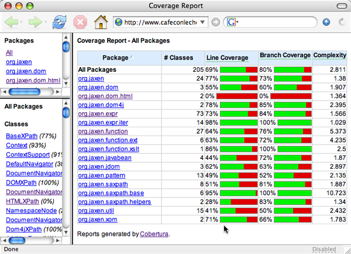
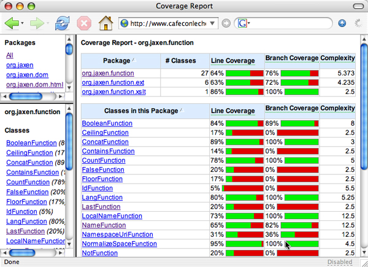

# Métricas y Calidad

## Cobertura de código

Porcentaje de líneas de código cubiertos por los tests.

Imagen de: http://www.cafeaulait.org/slides/albany/codecoverage/Measuring_JUnit_Code_Coverage.html

## Complejidad ciclomática

Mide la complejidad de un método en base al número de posibles caminos de código que hay dentro del método. Intenta ser una medida, por lo tanto, del mínimo número de tests necesarios para cubrir todos los posibles caminos.

http://gmetrics.sourceforge.net/gmetrics-CyclomaticComplexityMetric.html

Se considera una medida del "riesgo" que tiene una función de introducir bugs ante cambios en la misma. 

Imagen de: http://www.cafeaulait.org/slides/albany/codecoverage/Measuring_JUnit_Code_Coverage.html

## Cognitive Complexity

Mide lo complejo que es de entender un método.

https://www.sonarsource.com/resources/white-papers/cognitive-complexity.html

## Change Risk Anti-Patterns (CRAP) Index

El índice CRAP se calcula en base a la complejidad ciclomática y a la cobertura de código. Está diseñado para analizar y predecir la cantidad de esfuerzo, dolor y tiempo requerido para mantener un trozo de código.
    
Aquel código que no sea muy complejo y esté bien cubierto por los tests, tendrá un índice CRAP bajo. El CRAP se puede reducir, por lo tanto, escribiendo tests y refactorizando el código para reducir la complejidad
  
Un método con un índice CRAP de más de 30 se considera CRAPpy (es decir, inaceptable, ofensivo, etc.).

http://gmetrics.sourceforge.net/gmetrics-CrapMetric.html

## Los tests como parte de la documentación

> ../phpunit-5.7.phar test --testdox doc.html

- Importancia de los nombres de los tests
- Importancia de que cada tests se dedique a una úncia especificación