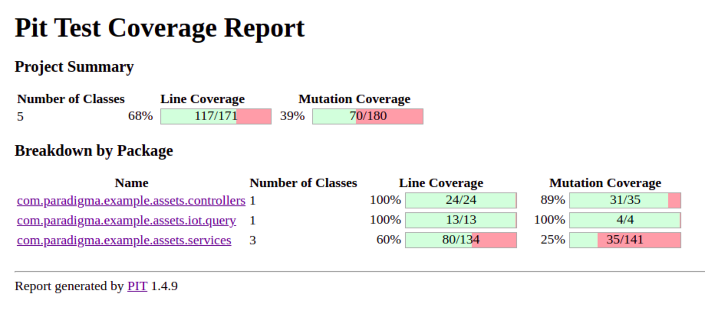

# Tests de mutaciones

Los *tests de mutaciones* son **tests de los tests unitarios**.

El objetivo es tener una idea de la calidad de los tests en cuanto a fiabilidad.

Su funcionamiento es relativamente sencillo: la herramienta que se utilice debe generar pequeños cambios en el código fuente. A estos pequeños cambios se les conoce como **mutantes**. Una vez introducidos estos mutantes en el código, se lanzan todos los tests.

Si los test unitarios fallan, es que han sido capaces de detectar ese cambio de código. En este caso el mutante se considera eliminado.

Si, por el contrario, los test unitarios pasan, el mutante sobrevive y la fiabilidad (y calidad) de los tests unitarios queda en entredicho.

Los test de mutaciones presentan reportes del porcentaje de mutantes detectados: cuanto más se acerque este porcentaje al 100%, mayor será la calidad de nuestros test unitarios.

## Configuración

Uno de los aspectos más importantes en los test de mutaciones es su configuración. No todos las herramientas nos permiten el mismo nivel de configuración, pero hay que aprovechar esto lo máximo posible, para evitar que la ejecución de los test conlleve un tiempo innecesariamente más largo de lo normal.

- El primer elemento que nos deben dejar configurar estas herramientas es decidir qué archivos de nuestro código queremos someter a las mutaciones.

- El segundo elemento es el tipo de mutaciones que queremos que sufra nuestro código. Hay mutaciones más de tipo matemático, en el que se reemplazan unos operadores aritméticos por otros; otros cambian las condiciones en un if; otros hacen que los return se devuelvan vacíos…

Aquí podemos ver el tipo de reportes que sacan las herramietnas de tests de mutado.

Imágenes obtenidas de: https://www.paradigmadigital.com/dev/test-mutaciones/

## Herramientas

- Pit Test